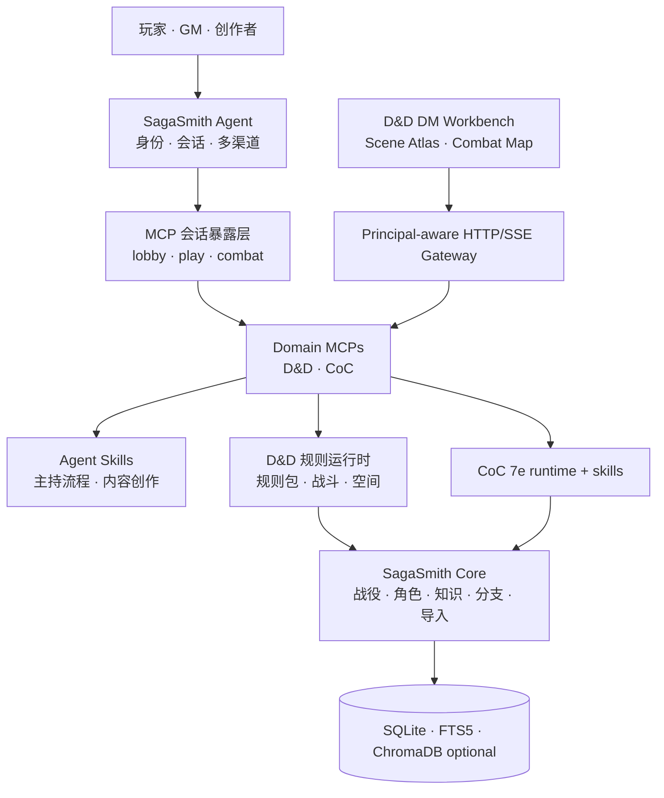

  

<h1 align="center">SagaSmithAI</h1>

  <strong>AI 原生 TTRPG 平台</strong> 
  <em>An AI-native platform for tabletop role-playing games.</em>

  让 AI 不只会讲故事，也能理解规则、维护世界状态、区分角色所知，并陪一张桌子走完长期战役。 
  AI that can adjudicate rules, preserve world state, respect who knows what, and stay with a campaign for the long haul.

  <a href="https://sagasmithai.github.io">Website</a> ·
  <a href="https://github.com/SagaSmithAI/SagaSmith-agent">Start with the Agent</a> ·
  <a href="https://github.com/SagaSmithAI/SagaSmith-dnd-mcp">D&D MCP</a> ·
  <a href="https://github.com/orgs/SagaSmithAI/repositories">All repositories</a>

---

## 为什么是 AI 原生

传统 VTT 以地图和表单为中心，聊天机器人以一次对话为中心。SagaSmithAI 把 **Agent、规则、记忆与内容** 放在同一个运行闭环里：

- **Agent 原生** — Skills 告诉 Agent 如何主持，MCP 提供可发现、可约束、可审计的真实能力；任意兼容 Agent 都能接入。
- **规则可执行** — 确定性的检定、战斗、资源与状态变化交给引擎；需要语境判断的部分仍由 GM/Agent 明确裁决。
- **战役可延续** — Snapshot DAG、分支、事件、修订式记忆与 continuity context 共同维护长期世界，而不是只保存聊天摘要。
- **知识有边界** — PC、NPC、玩家与 GM 各自拥有访问范围和 actor knowledge，避免隐藏信息与兄弟时间线串线。
- **内容可落地** — 规则书与模组从 PDF/Markdown 进入结构化导入、质量检查、检索、场景索引和规则包，而不是停留在向量片段。
- **系统可扩展** — `sagasmith-core` 保持规则无关；D&D 5e 和 CoC 7e 通过系统插件扩展，规则包与内容包可独立演进。

## 平台闭环

一次完整路径可以从 lobby 中导入规则书、模组与角色开始，进入 play 后按 Scene Atlas 推进并更新 actor knowledge，在 combat 中从 Scene Spatial 证据创建临时五尺格地图，最后写入事件、记忆与 Snapshot。工具暴露由 MCP 服务端按会话和阶段管理，因此不依赖某一个 Agent Host 的私有实现；UI Gateway 的写请求也实际调用 MCP 工具，不直写数据库。

## 从哪里开始

| 你想做什么 | 从这里开始 | 说明 |
|---|---|---|
| 直接搭建可聊天的 AI GM | [SagaSmith-agent](https://github.com/SagaSmithAI/SagaSmith-agent) | 多渠道 Agent、身份、会话和 MCP 编排 |
| 给现有 Agent 接入完整 D&D 能力 | [SagaSmith-dnd-mcp](https://github.com/SagaSmithAI/SagaSmith-dnd-mcp) | 当前最完整的端到端参考实现 |
| 给现有 Agent 接入 CoC 7e 能力 | [SagaSmith-coc-mcp](https://github.com/SagaSmithAI/SagaSmith-coc-mcp) | session exposure、调查/SAN/战斗/追逐与角色知识 |
| 构建新的 TTRPG 系统 | [sagasmith-core](https://github.com/SagaSmithAI/Sagasmith-core) | 系统无关的数据、分支、知识、导入与检索服务 |
| 使用或扩展 D&D 规则运行时 | [sagasmith-dnd](https://github.com/SagaSmithAI/Sagasmith-dnd) | D&D 5e 2014/2024 规则、内容和战斗引擎 |
| 使用 CoC 7e 运行时 | [sagasmith-coc](https://github.com/SagaSmithAI/Sagasmith-coc) | d100、SAN、战斗、追逐与模组解析 |
| 给 Agent 安装主持流程 | [D&D Skills](https://github.com/SagaSmithAI/SagaSmith-dnd-skills) / [CoC Skills](https://github.com/SagaSmithAI/SagaSmith-coc-skills) | 可移植的 SKILL.md 工作流与参考资料 |
| 生成可导入的冒险模组 | [Module Generator Skills](https://github.com/SagaSmithAI/SagaSmith-module-gen-skills) | 25 种结构范式和分阶段生成流程 |

## 仓库地图

| 层 | 仓库 | 职责 | 当前定位 |
|---|---|---|---|
| Agent | [SagaSmith-agent](https://github.com/SagaSmithAI/SagaSmith-agent) | 多渠道、模型、会话、身份、MCP client | Alpha，主要入口 |
| MCP | [SagaSmith-dnd-mcp](https://github.com/SagaSmithAI/SagaSmith-dnd-mcp) | D&D 能力面、存储所有权、渐进式工具暴露 | D&D 参考实现 |
| MCP | [SagaSmith-coc-mcp](https://github.com/SagaSmithAI/SagaSmith-coc-mcp) | CoC 能力面、角色授权、渐进式工具暴露 | 可实测垂直链路 |
| Core | [sagasmith-core](https://github.com/SagaSmithAI/Sagasmith-core) | 系统无关持久化、导入、检索、分支与知识 | Python library |
| System | [sagasmith-dnd](https://github.com/SagaSmithAI/Sagasmith-dnd) | D&D 5e 2014/2024 规则与战斗 | 活跃开发 |
| System | [sagasmith-coc](https://github.com/SagaSmithAI/Sagasmith-coc) | Call of Cthulhu 7e 规则运行时 | 活跃开发 |
| Skills | [SagaSmith-dnd-skills](https://github.com/SagaSmithAI/SagaSmith-dnd-skills) | D&D 主持和战役管理方法 | MCP-first full + portable |
| Skills | [SagaSmith-coc-skills](https://github.com/SagaSmithAI/SagaSmith-coc-skills) | CoC 守秘与调查团管理方法 | CLI full + portable |
| Creation | [SagaSmith-module-gen-skills](https://github.com/SagaSmithAI/SagaSmith-module-gen-skills) | 结构化冒险生成 | Agent skill |
| UI | [sagasmith-dnd-ui](https://github.com/SagaSmithAI/sagasmith-dnd-ui) | Scene Atlas、空间证据、临时战斗地图 | Integrated Alpha，可开始本地实测 |
| UI | [sagasmith-coc-ui](https://github.com/SagaSmithAI/sagasmith-coc-ui) | CoC Keeper 工作台 | Prototype |
| UI | [sagasmith-ui](https://github.com/SagaSmithAI/sagasmith-ui) | 跨系统客户端探索 | Prototype |
| Web | [SagaSmithAI.github.io](https://github.com/SagaSmithAI/SagaSmithAI.github.io) | 官网、架构和生态入口 | Static site |

## 设计边界

1. **Agent 不拥有领域数据库。** Agent 负责会话、身份和调度；领域 MCP 拥有规则、模组、战役数据与写入过程。
2. **Skills 不伪装成引擎。** Skills 描述策略与流程；可结算的状态变化必须经过 MCP/规则运行时。
3. **自动结算不取代 GM 判断。** 输入已经确定且规则机械化时自动结算；目标、意图、视线、例外和叙事代价不明确时请求裁决。
4. **检索不是权威状态。** FTS/向量检索负责找候选；关系数据库、规则包锁定与分支祖先链负责决定有效事实。
5. **商业内容不随代码分发。** 用户只能导入自己有权使用的规则书和模组；派生索引保留来源与版本信息。

## News

<!-- NEWS_START -->

### 2026-07-15 — SagaSmithAI 转向 AI 原生 TTRPG 平台

品牌与仓库信息架构统一为 AI-native TTRPG platform。D&D 参考路径现在明确为 Agent → MCP session exposure → rules/runtime → Core，并以 lobby、play、combat 三阶段控制工具发现与调用。

官网、组织 Profile 和全部仓库 README 同步标注真实边界与成熟度；D&D UI 重新定位为面向开团现场的 Alpha DM Workbench。

<!-- NEWS_END -->

## 项目状态

SagaSmithAI 仍处于 **Alpha / active development**。D&D MCP 路径已覆盖规则、记忆、内容导入、会话 exposure、多人投影、Scene Atlas、临时战斗地图与 UI Gateway；CoC 正在向同一能力边界演进。当前适合本地开发、集成验证与实团测试，不应被视作托管式商业 VTT 或规则内容分发服务。

代码默认使用 MIT License。D&D SRD 派生内容遵循对应的 Creative Commons 许可与仓库内 NOTICE；商业规则内容不包含在发行物中。
