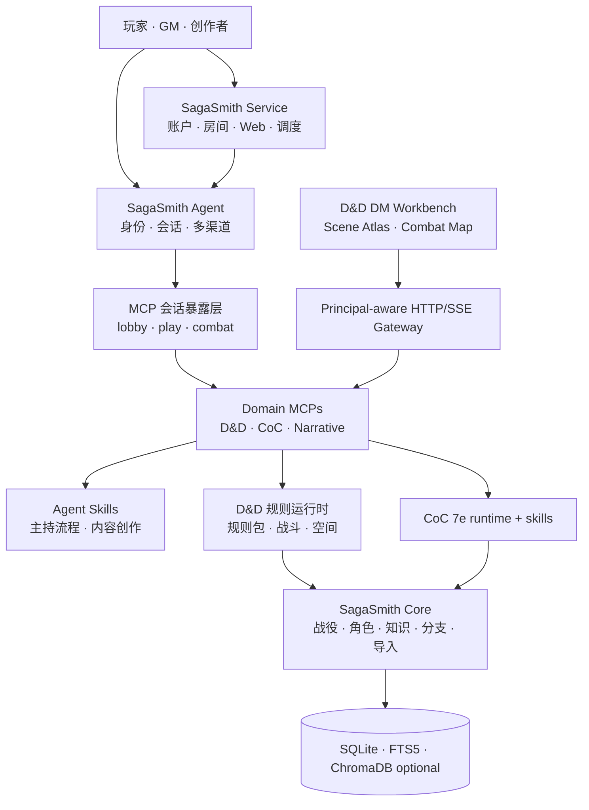

  

<h1 align="center">SagaSmithAI</h1>

  <strong>AI 原生 TTRPG 平台</strong> 
  <em>An AI-native platform for tabletop role-playing games.</em>

  让 AI 不只会讲故事，也能理解规则、维护世界状态、区分角色所知，并陪一张桌子走完长期战役。 
  AI that can adjudicate rules, preserve world state, respect who knows what, and stay with a campaign for the long haul.

  <a href="https://sagasmithai.github.io">Website</a> ·
  <a href="https://github.com/SagaSmithAI/SagaSmith-agent">Start with the Agent</a> ·
  <a href="https://github.com/SagaSmithAI/SagaSmith-service">Hosted Service</a> ·
  <a href="https://github.com/SagaSmithAI/SagaSmith-dnd-content-library">Content Catalog</a> ·
  <a href="https://github.com/SagaSmithAI/sagasmith-dnd">D&D Domain</a> ·
  <a href="https://github.com/orgs/SagaSmithAI/repositories">All repositories</a>

---

## 为什么是 AI 原生

传统 VTT 以地图和表单为中心，聊天机器人以一次对话为中心。SagaSmithAI 把 **Agent、规则、记忆与内容** 放在同一个运行闭环里：

- **Agent 原生** — Skills 告诉 Agent 如何主持，MCP 提供可发现、可约束、可审计的真实能力；任意兼容 Agent 都能接入。
- **规则可执行** — 确定性的检定、战斗、资源与状态变化交给引擎；需要语境判断的部分仍由 GM/Agent 明确裁决。
- **战役可延续** — Snapshot DAG、分支、事件、修订式记忆与 continuity context 共同维护长期世界，而不是只保存聊天摘要。
- **知识有边界** — PC、NPC、玩家与 GM 各自拥有访问范围和 actor knowledge，避免隐藏信息与兄弟时间线串线。
- **内容可落地** — 规则书与模组从 PDF/Markdown 进入结构化导入、质量检查、检索、场景索引和规则包，而不是停留在向量片段。
- **内容可迁移** — 核心规则、Addon、模组和预设共用一个可校验归档；PC、NPC、怪物共享角色卡，原文、Scene Atlas、资产、角色图、审核内容和稳定引用随包迁移。
- **系统可扩展** — `sagasmith-core` 保持规则无关；D&D 5e 和 CoC 7e 通过系统插件扩展，规则包与内容包可独立演进。

## 平台闭环

```mermaid
flowchart TB
    H[玩家 · GM · 创作者] --> W[SagaSmith Service<br/>账户 · 房间 · Web · 调度]
    H --> A[SagaSmith Agent<br/>身份 · 会话 · 多渠道]
    W --> A
    A --> X[MCP 会话暴露层<br/>lobby · play · combat]
    X --> M[Domain MCPs<br/>D&D · CoC · Narrative]
    M --> S[Agent Skills<br/>主持流程 · 内容创作]
    M --> D[D&D 规则运行时<br/>规则包 · 战斗 · 空间]
    D --> C[SagaSmith Core<br/>战役 · 角色 · 知识 · 分支 · 导入]
    C --> P[(SQLite · FTS5 · ChromaDB optional)]
    U[D&D DM Workbench<br/>Scene Atlas · Combat Map] --> G[Principal-aware HTTP/SSE Gateway]
    G --> M
    M --> R[CoC 7e runtime + skills]
    R --> C
```

一次完整路径从 lobby 中用 `rulebook_draft` / `module_draft` 完成机械首轮、Agent 审稿与定稿，再由 `content_pack` 管理不可变 Pack；进入 play 后按 Scene Atlas 推进并更新 actor knowledge。combat 固定 `grid` 或 `agent` 空间模式：前者使用临时地图和完整坐标，后者由 Agent 提交逐动作空间事实。最后写入事件、记忆与 Snapshot。工具暴露由 MCP 服务端按会话和阶段管理，因此不依赖某一个 Agent Host 的私有实现；UI Gateway 的写请求也实际调用 MCP 工具，不直写数据库。

## 从哪里开始

| 你想做什么 | 从这里开始 | 说明 |
|---|---|---|
| 直接搭建可聊天的 AI GM | [SagaSmith-agent](https://github.com/SagaSmithAI/SagaSmith-agent) | 多渠道 Agent、身份、会话和 MCP 编排 |
| 运行托管账户与多人房间 | [SagaSmith-service](https://github.com/SagaSmithAI/SagaSmith-service) | 公开源码仓库；账户、配额、房间、Agent 调度与多系统编排 |
| 给现有 Agent 接入完整 D&D 能力 | [sagasmith-dnd](https://github.com/SagaSmithAI/sagasmith-dnd) | Domain、MCP、Skills、UI 与模组生成的完整垂直实现 |
| 给现有 Agent 接入 CoC 7e 能力 | [sagasmith-coc](https://github.com/SagaSmithAI/sagasmith-coc) | Domain、MCP、Skills、UI 与模组生成的完整垂直实现 |
| 构建新的 TTRPG 系统 | [sagasmith-core](https://github.com/SagaSmithAI/Sagasmith-core) | 系统无关的数据、分支、知识、导入与检索服务 |
| 使用或扩展 D&D 规则运行时 | [sagasmith-dnd](https://github.com/SagaSmithAI/Sagasmith-dnd) | D&D 5e 2014/2024 规则、内容和战斗引擎 |
| 使用 CoC 7e 运行时 | [sagasmith-coc](https://github.com/SagaSmithAI/Sagasmith-coc) | d100、SAN、战斗、追逐与模组解析 |
| 构建系统无关长线叙事 | [sagasmith-narrative](https://github.com/SagaSmithAI/sagasmith-narrative) | Domain、stdio MCP、Skills、连续性与项目生成 |
| 给 Agent 安装主持流程 | [D&D Skills](https://github.com/SagaSmithAI/sagasmith-dnd/tree/main/skills) / [CoC Skills](https://github.com/SagaSmithAI/sagasmith-coc/tree/main/skills) / [Narrative Skills](https://github.com/SagaSmithAI/sagasmith-narrative/tree/main/skills) | 随领域代码共同版本化的 SKILL.md 工作流与参考资料 |
| 生成可导入的冒险模组 | [D&D generator](https://github.com/SagaSmithAI/sagasmith-dnd/tree/main/skills/dnd-module-generator) / [CoC generator](https://github.com/SagaSmithAI/sagasmith-coc/tree/main/skills/coc-module-generator) | 分系统的来源解释和分阶段生成流程 |
| 浏览当前内容包目录 | [Content Pack Library](https://github.com/SagaSmithAI/SagaSmith-dnd-content-library) | 公开仓库与校验和索引；每个 Pack 仍保留独立许可和分发限制 |

## 仓库地图

| 层 | 仓库 | 职责 | 当前定位 |
|---|---|---|---|
| Agent | [SagaSmith-agent](https://github.com/SagaSmithAI/SagaSmith-agent) | 多渠道、模型、会话、身份、MCP client | Alpha，主要入口 |
| Service | [SagaSmith-service](https://github.com/SagaSmithAI/SagaSmith-service) | 托管账户、房间、配额、Agent 调度、Web 与多系统编排 | Public source，专有许可 |
| Core | [sagasmith-core](https://github.com/SagaSmithAI/Sagasmith-core) | 系统无关持久化、导入、检索、分支与知识 | Python library |
| Domain | [sagasmith-dnd](https://github.com/SagaSmithAI/sagasmith-dnd) | D&D 规则、MCP、Skills、UI 与模组生成 | 可实测垂直链路 |
| Domain | [sagasmith-coc](https://github.com/SagaSmithAI/sagasmith-coc) | CoC 规则、MCP、Skills、UI 与模组生成 | 可实测垂直链路 |
| Domain | [sagasmith-narrative](https://github.com/SagaSmithAI/sagasmith-narrative) | 系统无关叙事 Domain、stdio MCP、Skills 与项目生成 | 可实测夹具与真实 Host 回归 |
| Web | [SagaSmithAI.github.io](https://github.com/SagaSmithAI/SagaSmithAI.github.io) | 官网、架构和生态入口 | Static site |
| Content | [SagaSmith-dnd-content-library](https://github.com/SagaSmithAI/SagaSmith-dnd-content-library) | D&D/CoC 当前统一内容包、来源/资产 blobs 与机器索引 | Public repository；内容权利逐包判断 |

## 设计边界

1. **Agent 不拥有领域数据库。** Agent 负责会话、身份和调度；领域 MCP 拥有规则、模组、战役数据与写入过程。
2. **Skills 不伪装成引擎。** Skills 描述策略与流程；可结算的状态变化必须经过 MCP/规则运行时。
3. **引擎与 Agent 各自裁决。** 输入已经确定且规则机械化时由引擎结算；来源无冲突的目标、意图、无坐标空间关系、例外和叙事代价由 Agent 判断。只有玩家选择、Owner 审批、权限变化或缺失/冲突来源需要外部输入。
4. **检索不是权威状态。** FTS/向量检索负责找候选；关系数据库、规则包锁定与分支祖先链负责决定有效事实。
5. **商业内容不随代码分发。** 用户只能导入自己有权使用的规则书和模组；派生索引保留来源与版本信息。
6. **内容包不是存档。** `sagasmith.content-package` 以 checksum、稳定来源引用和新运行时身份导入；权限、ActorKnowledge、进度、随机流和 Snapshot 不随内容包迁移，导入也不自动授予分支启用权限。
7. **Host 身份必须可验证。** Service 使用共享密钥签发带时效的 `sagasmith.auth-context/v1`；Agent 负责传递会话身份，领域 MCP 仍在每次调用时重新校验角色、战役、actor、阶段与 revision。

## News

<!-- NEWS_START -->

### 2026-08-20 — 最新运行时完成并行参考战役回归

长回归现在会从当前 Agent、Core、D&D、CoC、Narrative 与 Service 源码重建托管栈，
再以隔离客户端并发运行 D&D 与 CoC 参考战役。两条路径均完成且没有记录到回归缺口，
D&D 额外写入一个合法结局；每个 campaign 的日志、运行时 revision 与总结果都保存为
机器可读证据。目录中未实际执行的模组和互斥路径继续明确列为 exclusion，不会被当作
隐式通过。Service → Agent → MCP 的 principal context 同时切换为带时效签名协议。

### 2026-08-19 — 三条领域链路收敛为垂直 monorepo

D&D、CoC 与 Narrative 现在各由一个领域仓库共同版本化 Domain、MCP、Skills、领域 UI
（如有）和对应的创作生成流程。`sagasmith-core`、Agent、Service、内容目录与官网继续独立；
原来的 MCP、Skills、UI 和通用 Module Generator 仓库已归档为只读历史。这些领域
组件的当前开发、发布、Issue 与文档入口仅为三个领域 monorepo。

### 2026-08-18 — 托管 Service 与当前 Content Pack 目录公开

`SagaSmith-service` 与 `SagaSmith-dnd-content-library` 现为公开仓库。Service 已接通
D&D/CoC 多系统房间、托管主持身份、结构化回合与 audience-safe resolution
presentation；内容目录公开 46 个校验和绑定的当前 Pack 记录。仓库可见性不改变
Service 的专有许可，也不替代每个 Pack、来源和资产自己的使用与分发授权。

### 2026-08-02 — 统一可分享角色卡、结构化模组与扩展规则包

PC、NPC 与怪物现在使用同一个 `sagasmith.actor-card.v3` 边界；默认怪物与 NPC
作为 preset 内容包提供。核心规则、Addon、模组和预设共用 `.sagasmith-pack`；
结构化模组可以携带原文、Scene Atlas、checksum-bound 资产、角色图、审核内容、NPC/怪物/预设 PC 卡及稳定关联，并通过公开 MCP
路径在另一安装中生成全新身份。战役进度、角色知识、分支与 Snapshot 保持隔离。
扩展规则书现在也能导出完整索引来源和稳定 citation，目标端重建本地 source/chunk
id 后保存内容定义；Pack 保存与战役启用仍是独立权限操作。旧 portable JSON、松散卡片、
release manifest 与 `.sagasmith-module` 不再属于公开协议。

### 2026-07-15 — SagaSmithAI 转向 AI 原生 TTRPG 平台

品牌与仓库信息架构统一为 AI-native TTRPG platform。D&D 参考路径现在明确为 Agent → MCP session exposure → rules/runtime → Core，并以 lobby、play、combat 三阶段控制工具发现与调用。

官网、组织 Profile 和全部仓库 README 同步标注真实边界与成熟度；D&D UI 重新定位为面向开团现场的 Alpha DM Workbench。

<!-- NEWS_END -->

## 项目状态

SagaSmithAI 仍处于 **Alpha / active development**。D&D 与 CoC MCP 路径已覆盖规则、记忆、内容导入、会话 exposure、受众投影和权威 resolution presentation，并已用最新托管运行时完成并行参考战役回归；Narrative MCP 提供系统无关长线叙事边界；公开的 Service 正在验证账户、多系统房间、托管主持与统一 Web。当前适合本地开发、集成验证与实团测试，不应被视作已经稳定运营的商业 VTT。

多数原创运行时、Skills、UI 与网站代码使用 Apache-2.0；`SagaSmith-service` 虽公开可见，仍以其仓库内专有 LICENSE 为准。D&D SRD 派生内容遵循对应的 Creative Commons 许可与仓库内 NOTICE；Content Pack 必须逐包核对许可、署名和分发授权。
