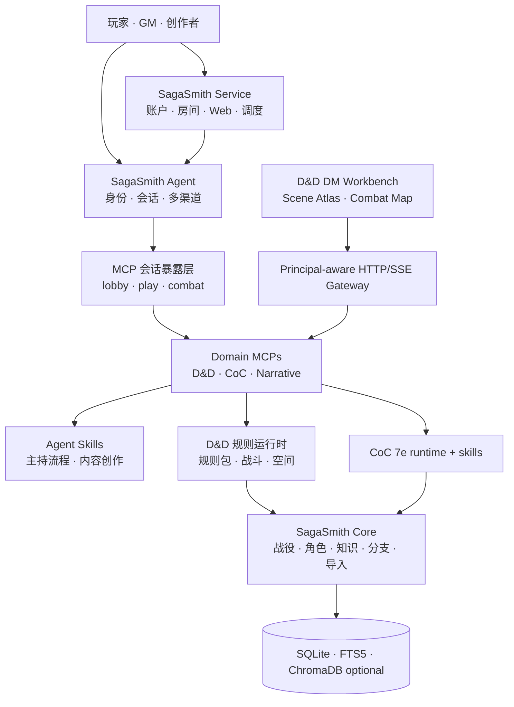

  

<h1 align="center">SagaSmithAI</h1>

  <strong>AI 原生 TTRPG 平台</strong> 
  <em>An AI-native platform for tabletop role-playing games.</em>

  让 AI 不只会讲故事，也能理解规则、维护世界状态、区分角色所知，并陪一张桌子走完长期战役。 
  AI that can adjudicate rules, preserve world state, respect who knows what, and stay with a campaign for the long haul.

  <a href="https://sagasmithai.github.io">Website</a> ·
  <a href="https://github.com/SagaSmithAI/SagaSmith-agent">Start with the Agent</a> ·
  <a href="https://github.com/SagaSmithAI/SagaSmith-service">Hosted Service</a> ·
  <a href="https://github.com/SagaSmithAI/SagaSmith-dnd-content-library">Content Catalog</a> ·
  <a href="https://github.com/SagaSmithAI/sagasmith-dnd">D&D Domain</a> ·
  <a href="https://github.com/orgs/SagaSmithAI/repositories">All repositories</a>

---

## 为什么是 AI 原生

传统 VTT 以地图和表单为中心，聊天机器人以一次对话为中心。SagaSmithAI 把 **Agent、规则、记忆与内容** 放在同一个运行闭环里：

- **Agent 原生** — Skills 告诉 Agent 如何主持，MCP 提供可发现、可约束、可审计的真实能力；任意兼容 Agent 都能接入。
- **规则可执行** — 确定性的检定、战斗、资源与状态变化交给引擎；需要语境判断的部分仍由 GM/Agent 明确裁决。
- **战役可延续** — Snapshot DAG、分支、事件、修订式记忆与 continuity context 共同维护长期世界，而不是只保存聊天摘要。
- **知识有边界** — PC、NPC、玩家与 GM 各自拥有访问范围和 actor knowledge，避免隐藏信息与兄弟时间线串线。
- **内容可落地** — 规则书与模组从 PDF/Markdown 进入结构化导入、质量检查、检索、场景索引和规则包，而不是停留在向量片段。
- **内容可迁移** — 核心规则、Addon、模组和预设共用一个可校验归档；PC、NPC、怪物共享角色卡，原文、Scene Atlas、资产、角色图、审核内容和稳定引用随包迁移。
- **系统可扩展** — `sagasmith-core` 保持规则无关；D&D 5e 和 CoC 7e 通过系统插件扩展，规则包与内容包可独立演进。

## 平台闭环

```mermaid
flowchart TB
    H[玩家 · GM · 创作者] --> W[SagaSmith Service<br/>账户 · 房间 · Web · 调度]
    H --> A[SagaSmith Agent<br/>身份 · 会话 · 多渠道]
    W --> A
    A --> X[MCP 会话暴露层<br/>lobby · play · combat]
    X --> M[Domain MCPs<br/>D&D · CoC · Narrative]
    M --> S[Agent Skills<br/>主持流程 · 内容创作]
    M --> D[D&D 规则运行时<br/>规则包 · 战斗 · 空间]
    D --> C[SagaSmith Core<br/>战役 · 角色 · 知识 · 分支 · 导入]
    C --> P[(SQLite · FTS5 · ChromaDB optional)]
    U[D&D DM Workbench<br/>Scene Atlas · Combat Map] --> G[Principal-aware HTTP/SSE Gateway]
    G --> M
    M --> R[CoC 7e runtime + skills]
    R --> C
```

一次完整路径从 lobby 中用 `rulebook_draft` / `module_draft` 完成机械首轮、Agent 审稿与定稿，再由 `content_pack` 管理不可变 Pack；进入 play 后按 Scene Atlas 推进并更新 actor knowledge。combat 固定 `grid` 或 `agent` 空间模式：前者使用临时地图和完整坐标，后者由 Agent 提交逐动作空间事实。最后写入事件、记忆与 Snapshot。工具暴露由 MCP 服务端按会话和阶段管理，因此不依赖某一个 Agent Host 的私有实现；UI Gateway 的写请求也实际调用 MCP 工具，不直写数据库。

## 从哪里开始

| 你想做什么 | 从这里开始 | 说明 |
|---|---|---|
| 直接搭建可聊天的 AI GM | [SagaSmith-agent](https://github.com/SagaSmithAI/SagaSmith-agent) | 多渠道 Agent、身份、会话和 MCP 编排 |
| 运行托管账户与多人房间 | [SagaSmith-service](https://github.com/SagaSmithAI/SagaSmith-service) | 公开源码仓库；账户、配额、房间、Agent 调度与多系统编排 |
| 给现有 Agent 接入完整 D&D 能力 | [sagasmith-dnd](https://github.com/SagaSmithAI/sagasmith-dnd) | Domain、MCP、Skills、UI 与模组生成的完整垂直实现 |
| 给现有 Agent 接入 CoC 7e 能力 | [sagasmith-coc](https://github.com/SagaSmithAI/sagasmith-coc) | Domain、MCP、Skills、UI 与模组生成的完整垂直实现 |
| 构建新的 TTRPG 系统 | [sagasmith-core](https://github.com/SagaSmithAI/Sagasmith-core) | 系统无关的数据、分支、知识、导入与检索服务 |
| 使用或扩展 D&D 规则运行时 | [sagasmith-dnd](https://github.com/SagaSmithAI/Sagasmith-dnd) | D&D 5e 2014/2024 规则、内容和战斗引擎 |
| 使用 CoC 7e 运行时 | [sagasmith-coc](https://github.com/SagaSmithAI/Sagasmith-coc) | d100、SAN、战斗、追逐与模组解析 |
| 构建系统无关长线叙事 | [sagasmith-narrative](https://github.com/SagaSmithAI/sagasmith-narrative) | Domain、stdio MCP、Skills、连续性与项目生成 |
| 给 Agent 安装主持流程 | [D&D Skills](https://github.com/SagaSmithAI/sagasmith-dnd/tree/main/skills) / [CoC Skills](https://github.com/SagaSmithAI/sagasmith-coc/tree/main/skills) / [Narrative Skills](https://github.com/SagaSmithAI/sagasmith-narrative/tree/main/skills) | 随领域代码共同版本化的 SKILL.md 工作流与参考资料 |
| 生成可导入的冒险模组 | [D&D generator](https://github.com/SagaSmithAI/sagasmith-dnd/tree/main/skills/dnd-module-generator) / [CoC generator](https://github.com/SagaSmithAI/sagasmith-coc/tree/main/skills/coc-module-generator) | 分系统的来源解释和分阶段生成流程 |
| 浏览当前内容包目录 | [Content Pack Library](https://github.com/SagaSmithAI/SagaSmith-dnd-content-library) | 公开仓库与校验和索引；每个 Pack 仍保留独立许可和分发限制 |

## 仓库地图

| 层 | 仓库 | 职责 | 当前定位 |
|---|---|---|---|
| Agent | [SagaSmith-agent](https://github.com/SagaSmithAI/SagaSmith-agent) | 多渠道、模型、会话、身份、MCP client | Alpha，主要入口 |
| Service | [SagaSmith-service](https://github.com/SagaSmithAI/SagaSmith-service) | 托管账户、房间、配额、Agent 调度、Web 与多系统编排 | Public source，专有许可 |
| Core | [sagasmith-core](https://github.com/SagaSmithAI/Sagasmith-core) | 系统无关持久化、导入、检索、分支与知识 | Python library |
| Domain | [sagasmith-dnd](https://github.com/SagaSmithAI/sagasmith-dnd) | D&D 规则、MCP、Skills、UI 与模组生成 | 可实测垂直链路 |
| Domain | [sagasmith-coc](https://github.com/SagaSmithAI/sagasmith-coc) | CoC 规则、MCP、Skills、UI 与模组生成 | 可实测垂直链路 |
| Domain | [sagasmith-narrative](https://github.com/SagaSmithAI/sagasmith-narrative) | 系统无关叙事 Domain、stdio MCP、Skills 与项目生成 | 可实测夹具与真实 Host 回归 |
| Web | [SagaSmithAI.github.io](https://github.com/SagaSmithAI/SagaSmithAI.github.io) | 官网、架构和生态入口 | Static site |
| Content | [SagaSmith-dnd-content-library](https://github.com/SagaSmithAI/SagaSmith-dnd-content-library) | D&D/CoC 当前统一内容包、来源/资产 blobs 与机器索引 | Public repository；内容权利逐包判断 |

## 设计边界

1. **Agent 不拥有领域数据库。** Agent 负责会话、身份和调度；领域 MCP 拥有规则、模组、战役数据与写入过程。
2. **Skills 不伪装成引擎。** Skills 描述策略与流程；可结算的状态变化必须经过 MCP/规则运行时。
3. **引擎与 Agent 各自裁决。** 输入已经确定且规则机械化时由引擎结算；来源无冲突的目标、意图、无坐标空间关系、例外和叙事代价由 Agent 判断。只有玩家选择、Owner 审批、权限变化或缺失/冲突来源需要外部输入。
4. **检索不是权威状态。** FTS/向量检索负责找候选；关系数据库、规则包锁定与分支祖先链负责决定有效事实。
5. **商业内容不随代码分发。** 用户只能导入自己有权使用的规则书和模组；派生索引保留来源与版本信息。
6. **内容包不是存档。** `sagasmith.content-package` 以 checksum、稳定来源引用和新运行时身份导入；权限、ActorKnowledge、进度、随机流和 Snapshot 不随内容包迁移，导入也不自动授予分支启用权限。
7. **Host 身份必须可验证。** Service 使用共享密钥签发带时效的 `sagasmith.auth-context/v1`；Agent 负责传递会话身份，领域 MCP 仍在每次调用时重新校验角色、战役、actor、阶段与 revision。

## News

<!-- NEWS_START -->

### 2026-08-20 — 最新运行时完成 D&D 与 CoC 并行参考战役回归

长回归会先从当前 `SagaSmith-agent`、`sagasmith-core`、三个领域仓库与
`SagaSmith-service` 源码重建并重建容器，再开始任何房间动作。Service 使用临时共享
密钥签发带时效的 `sagasmith.auth-context/v1`，Agent 将 principal context 传给
会话作用域 MCP；领域服务仍在实际调用边界重新校验身份、角色、战役与 revision。

2026-08-20 的参考运行以隔离客户端并发完成 D&D 与 CoC 战役，没有记录到回归缺口；
D&D 路径额外记录了一个合法结局。`runtime-refresh.json`、`summary.json` 与逐战役日志
保存了构建 revision、调用结果和缺口列表。

runner 会发现目录中的全部当前模组，并把没有执行的项目与互斥路径写成机器可读
exclusion。这条结果证明当前参考集成边界可以工作，不代表全部 46 个 Pack 或每条剧情
分支都已经完整通关。

### 2026-08-19 — D&D、CoC 与 Narrative 完成垂直仓库收敛

`sagasmith-dnd`、`sagasmith-coc` 与 `sagasmith-narrative` 现在分别作为一条
完整领域链路的唯一源码入口。每个仓库共同版本化确定性 Domain、权威 MCP、Agent
Skills、领域 UI（如有）和对应的 Pack/项目创作流程，同时继续保持各组件的运行时
职责与权限边界。

原独立 MCP、Skills、UI 和通用 Module Generator 仓库已经归档。它们仍可用于历史
审计，但不再接收当前 Issue、发布或集成，也不会被 Agent、Service 或安装器作为
兼容回退。

`sagasmith-core`、`SagaSmith-agent`、`SagaSmith-service`、内容目录、官网与组织文档
继续独立。开发者页和各仓库 README 已切换到当前拓扑，Service 的组件锁也只保留
实际参与当前构建的仓库。

### 2026-08-18 — 托管 Service 与当前内容目录进入公开开发

`SagaSmith-service` 现在公开展示托管账户、配额、战役房间、主持身份、Agent
调度、统一 Web 与多系统 MCP 编排。Service 不拥有 D&D 或 CoC 的权威游戏状态；
每一次领域操作仍交给对应 MCP 重新做权限、revision、阶段和角色范围校验。

托管房间现在可以把 Agent 输出拆成公开叙述、角色演绎、提示与权威
`resolution_ref`。D&D 与 CoC MCP 返回按受众过滤的 resolution presentation，
前端只渲染服务端已经允许的骰点、结果和待选择项。

`SagaSmith-dnd-content-library` 同时改为公开仓库，机器索引记录当前 46 个不可变
Pack 的身份、依赖、大小和校验和。公开可见不等于开放内容许可：每个 Pack、来源、
角色图和其他资产继续保留自己的许可、署名与分发限制，使用者必须自行确认授权。

Service 的公开仓库仍以其专有 `LICENSE` 为准；SagaSmith 的 Apache-2.0 运行时、
Skills、UI 与网站也继续按各自仓库的许可证发布。

### 2026-08-02 — 角色、结构化模组与扩展规则进入统一分享格式

PC、NPC 和怪物现在使用同一个 `sagasmith.actor-card.v3`。导入会创建
新的 Character identity，并且不会携带来源数据库 id、权限或 actor knowledge。
2014 与 2024 的怪物/NPC 由默认 preset 内容包提供，而不是写死在 Host 或遭遇
驱动器里。

核心规则、Addon、模组和预设现在全部使用 `sagasmith.content-package` v2 的
`.sagasmith-pack` 归档。结构化模组可以打包标准化原文、Scene Atlas、地图与其他
内容寻址资产、审核内容、NPC、怪物、预设 PC、角色图及其稳定场景关联，再通过公开 MCP
工具在另一安装中重新导入。
内容包不是战役存档：进度、世界状态、记忆、随机流、分支与 Snapshot 继续留在
各自的权威运行时账本中。

经过审核的扩展规则包现在可以连同完整索引来源一起导出。本地 source/chunk id
会转换为稳定引用，目标端校验 system、edition、依赖 version 与不受本地 UUID
影响的 definition checksum 后用新 id 重建。规则内容的安装不会自动进行分支启用；
Addon 与模组激活仍需独立的 Owner/DM 操作。旧 portable JSON、松散角色卡、release
manifest 与 `.sagasmith-module` 已退出公开协议，不存在静默兼容路径。

内容包的技术可迁移性不代表内容获得了再分发授权。完整规则书、模组原文与从其页面
提取的角色图必须继续服从各自许可。2026-08-18 起当前目录仓库公开可见，但这只公开
索引与仓库状态，不会把任何 Pack 自动变成开放内容；下载、导入和再分发仍需逐包核对
`license_evidence`、署名、资产许可与来源授权。

### 2026-07-15 — D&D Workbench 打通 Scene Atlas 与临时战斗地图

D&D UI 现在区分三类数据：按模组顺序组织的 Scene Index、只表达来源证据的 Scene Spatial，以及战斗开始时创建的临时五尺格 Combat Map。背景占位素材不携带墙体、掩体或视线等机械含义。

本地 principal-aware Gateway 通过 MCP 工具投影场景、进度与战斗状态，并用 SSE 通知 campaign revision 变化。拖动 Token 只提出移动请求，最终仍由 MCP 验证权限、分支、幂等、距离、阻挡与反应窗口。

<!-- NEWS_END -->

## 项目状态

SagaSmithAI 仍处于 **Alpha / active development**。D&D 与 CoC MCP 路径已覆盖规则、记忆、内容导入、会话 exposure、受众投影和权威 resolution presentation，并已用最新托管运行时完成并行参考战役回归；Narrative MCP 提供系统无关长线叙事边界；公开的 Service 正在验证账户、多系统房间、托管主持与统一 Web。当前适合本地开发、集成验证与实团测试，不应被视作已经稳定运营的商业 VTT。

多数原创运行时、Skills、UI 与网站代码使用 Apache-2.0；`SagaSmith-service` 虽公开可见，仍以其仓库内专有 LICENSE 为准。D&D SRD 派生内容遵循对应的 Creative Commons 许可与仓库内 NOTICE；Content Pack 必须逐包核对许可、署名和分发授权。
