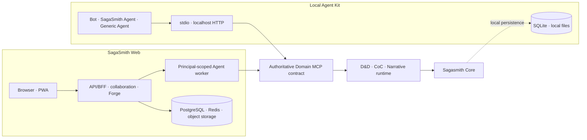

<p align="center">
  <a href="https://sagasmithai.github.io">
    
  </a>
</p>

<h1 align="center">让世界记得每一次选择</h1>

<p align="center">
  <strong>AI 原生 TTRPG 平台 · An AI-native TTRPG platform</strong><br>
  Agent 负责理解与主持，规则引擎负责确定性结算，领域 MCP 负责权威状态。<br>
  Agents interpret and host; engines settle deterministic rules; domain MCPs own authoritative state.
</p>

<p align="center">
  <a href="https://sagasmithai.github.io/start"><strong>开始使用</strong></a> ·
  <a href="https://sagasmithai.github.io">官网</a> ·
  <a href="https://sagasmithai.github.io/developers">架构</a> ·
  <a href="https://github.com/SagaSmithAI/SagaSmith-agent">Local Agent Kit</a> ·
  <a href="https://github.com/SagaSmithAI/SagaSmith-Web">SagaSmith Web</a> ·
  <a href="https://github.com/orgs/SagaSmithAI/repositories">全部仓库</a>
</p>

> **当前阶段：Active Alpha。** 适合本地开发、集成验证与实团测试；公开源码、参考战役通过或仓库可见，都不等于生产服务承诺或内容再分发授权。
>
> **Current stage: Active Alpha.** Ready for local development, integration validation, and real-table testing—not a production-service or content-licensing promise.

## 选择你的入口

| 我想要…… | 当前入口 | 运行边界 |
|---|---|---|
| 自己运行 Discord、QQ、Telegram Bot 或本地 AI GM | [**SagaSmith Local Agent Kit**](https://github.com/SagaSmithAI/SagaSmith-agent) | Agent + 所选 Domain MCP + SQLite / 本地文件；不依赖 Web、PostgreSQL、Redis 或对象存储 |
| 让 Codex、Claude Code、OpenClaw 等现有 Agent 使用 SagaSmith | [**MCP 配置与无凭证模板**](https://github.com/SagaSmithAI/SagaSmith-agent/tree/main/examples/local-agent-kit) | 通过 stdio 或 localhost Streamable HTTP 直接连接所选领域 MCP |
| 构建浏览器、多人房间、Forge 与 Module Studio | [**SagaSmith Web**](https://github.com/SagaSmithAI/SagaSmith-Web) | 浏览器前端 + API/BFF + 托管控制面 + principal-scoped Agent workers + 基础设施 |
| 接入 D&D 5e、CoC 7e 或系统无关长线叙事 | [**领域仓库**](#当前仓库地图) | Domain、MCP、Skills、UI（如有）与创作流程在同一 commit 下版本化 |

<details>
<summary><strong>English entry guide</strong></summary>

| Goal | Start here | Boundary |
|---|---|---|
| Run a local AI GM or channel bot | [SagaSmith Local Agent Kit](https://github.com/SagaSmithAI/SagaSmith-agent) | Agent + selected Domain MCP + SQLite/local files; no Web infrastructure required |
| Connect an existing MCP-capable Agent | [Credential-free templates](https://github.com/SagaSmithAI/SagaSmith-agent/tree/main/examples/local-agent-kit) | Direct stdio or localhost Streamable HTTP connection |
| Build the hosted browser product | [SagaSmith Web](https://github.com/SagaSmithAI/SagaSmith-Web) | Frontend, API/BFF, hosted control plane, Agent workers, and infrastructure |
| Extend a game system | [Current domain repositories](#当前仓库地图) | Domain, MCP, Skills, UI where present, and authoring flow versioned together |

</details>

## 两种部署，同一权威契约


```mermaid
flowchart LR
    subgraph Local[Local Agent Kit]
      LC[Bot · SagaSmith Agent · Generic Agent]
      LT[stdio · localhost HTTP]
      LD[(SQLite · local files)]
      LC --> LT
    end

    subgraph Hosted[SagaSmith Web]
      B[Browser · PWA]
      API[API/BFF · collaboration · Forge]
      W[Principal-scoped Agent worker]
      DB[(PostgreSQL · Redis · object storage)]
      B --> API --> W
      API --> DB
    end

    LT --> MCP[Authoritative Domain MCP contract]
    W --> MCP
    MCP --> R[D&D · CoC · Narrative runtime]
    R --> C[Sagasmith Core]
    C -. local persistence .-> LD
```

本地与 Hosted 只允许在 **transport、authentication、storage、deployment** 上不同。两条路径必须保持相同的 MCP handlers、tool schemas、错误、权限、revision、idempotency 与规则写入语义。

Local and hosted deployments may differ in **transport, authentication, storage, and deployment** only. MCP handlers, tool schemas, errors, authority, revisions, idempotency, and rule-write semantics stay identical.

### MCP `2026-07-28`：稳定目录，按需投影

现代链路不再依赖 `initialize`、`Mcp-Session-Id` 或连接内隐藏状态。每个请求携带协议版本、客户端能力与面向目标 MCP 的短期委托；跨调用状态使用服务器签发、绑定 owner 与 TTL 的显式 handle，且每次使用都会重新授权。handle 只是状态名称，不是权限凭证。

同一授权范围内的 `tools/list` 保持确定排序并通过 `ttlMs` / `cacheScope` 安全缓存。Agent Host 再按 **system × phase × role × task** 只向当前模型回合投影少量 facade 与相关工具，默认硬上限为 16 项，避免把完整目录塞入上下文；16 是 SagaSmith 的模型命中率策略，不是 MCP 协议限制。领域 MCP 仍对每次调用独立校验角色、阶段、revision 与具体 tool ID。迁移期保留的 handshake-era 路径仅用于明确兼容，并通过独立的 stdio / HTTP / Hosted contract matrix 验证。

**MCP `2026-07-28`: stable catalogs, task-scoped projection.** The modern path does not depend on `initialize`, `Mcp-Session-Id`, or hidden connection state. Every request carries its protocol version, client capabilities, and a short-lived delegation for the target MCP. Cross-call state uses explicit server-issued handles bound to an owner and TTL; a handle names state and never grants authority by itself. Within one authorization scope, `tools/list` is deterministically ordered and safely cacheable through `ttlMs` / `cacheScope`. The Agent host then projects only a small **system × phase × role × task** facade subset into each model turn, with a default hard cap of 16. That cap is a SagaSmith model-accuracy policy, not an MCP protocol limit. The domain MCP independently validates role, phase, revision, and the concrete tool ID on every call. Retained handshake-era behavior is compatibility-only and has a separate stdio / HTTP / Hosted contract matrix.

### 不能跨越的边界

- **Agent ≠ 领域数据库**：Agent 管理模型、身份、会话与渠道，不直接拥有规则或战役账本。
- **Skills ≠ 引擎**：Skills 描述主持与创作流程；可结算状态变化必须经过 MCP / runtime。
- **检索 ≠ 真相**：检索寻找候选证据；持久状态、分支祖先、规则锁与来源决定有效事实。
- **客户端 ≠ 权威**：浏览器和 Bot 只接收服务端按 principal、actor、campaign 与 phase 过滤的投影。
- **内容包 ≠ 存档**：Pack 不携带权限、ActorKnowledge、进度、随机流、分支或 Snapshot。
- **Web job ≠ MCP Task**：`RoomTurnJob` 负责队列、lease、heartbeat、重试、取消与恢复；MCP Task 只用于单个经过能力协商的真正长耗时工具。
- **Web cache ≠ 领域数据库**：Web 只消费 MCP 成功提交后的 revisioned receipt/outbox projection；failed、rolled-back 与 no-op 写入不触发伪失效。

## 本地安装入口

默认安装需要 Python 3.11+、[uv](https://docs.astral.sh/uv/) 与 Node.js 22.12+（含 npm）；纯后端安装可显式添加 `--skip-ui`。

```bash
git clone https://github.com/SagaSmithAI/SagaSmith-agent.git
cd SagaSmith-agent
uv run nanobot sagasmith install --source release --profile dnd-only
uv run nanobot onboard --wizard --config config/config.json --workspace workspace
uv run nanobot sagasmith doctor --json
uv run nanobot sagasmith start
```

`--source release` 会按 Agent 的发行锁克隆并固定所选组件；可将 `dnd-only` 换成 `coc-only`、`narrative-only` 或 `multi-system`。安装器不导入商业书籍、不自动激活 Pack，也不会替用户配置 provider secret。已有 sibling 源码工作区的开发者可按 Agent 文档改用 workspace source。完整步骤与 transport 选择见 [开始使用页面](https://sagasmithai.github.io/start)。

## 当前仓库地图

| 层 | 唯一当前入口 | 所有权 |
|---|---|---|
| Agent host | [SagaSmith-agent](https://github.com/SagaSmithAI/SagaSmith-agent) | 模型、身份、会话、Channels、MCP consumer、Local Kit 与 Hosted worker 基础 |
| Hosted product | [SagaSmith-Web](https://github.com/SagaSmithAI/SagaSmith-Web) | SagaSmith Web 前端、API/BFF、协作、Forge、Module Studio、Agent 编排与 operations |
| Neutral core | [Sagasmith-core](https://github.com/SagaSmithAI/Sagasmith-core) | 系统无关持久化、导入、检索、分支、知识与共享 runtime primitives |
| D&D vertical | [Sagasmith-dnd](https://github.com/SagaSmithAI/Sagasmith-dnd) | D&D Domain、权威 MCP、Skills、Workbench 与模组生成 |
| CoC vertical | [Sagasmith-coc](https://github.com/SagaSmithAI/Sagasmith-coc) | CoC 7e Domain、权威 MCP、Skills、Workbench 与模组生成 |
| Narrative vertical | [sagasmith-narrative](https://github.com/SagaSmithAI/sagasmith-narrative) | 系统无关 Narrative Domain、权威 MCP、Skills 与项目生成 |
| Content catalog | [SagaSmith-dnd-content-library](https://github.com/SagaSmithAI/SagaSmith-dnd-content-library) | 权利感知的 Pack、来源/资产 blob 与 checksum 索引 |
| Public site | [SagaSmithAI.github.io](https://github.com/SagaSmithAI/SagaSmithAI.github.io) | 官网、上手入口、架构与公开进展 |

原独立 MCP、Skills、UI 与通用 Module Generator 仓库是 **archived read-only history**：不接收新 Issue，不参与发布，也不是 compatibility fallback。

## 当前可验证范围

| 路径 | 当前状态 | 已有证据 | 不应扩张成的说法 |
|---|---|---|---|
| D&D 5e | Modern contract verified | 规则、内容、图片/grid、Tasks 长工具、稳定目录、stdio/HTTP 与参考战役路径 | 不代表所有 Pack 或剧情分支完整通关 |
| CoC 7e | Modern contract verified | 调查、检定、SAN、追逐、知识边界、稳定目录、stdio/HTTP 与参考战役路径 | 不代表完整 Hosted 产品已稳定运营 |
| Narrative | Modern contract verified | 系统无关连续性、隔离 NPC、三组原创 fixture、稳定目录、stdio/HTTP 与 Skills | 不代表任意系统规则可自动执行 |
| Extended ruleset import | Experimental | 来源保留、解析、质量报告、索引与 Pack 校验 | 不代表可以自动理解任意商业规则书 |

## Latest progress

<!-- NEWS_START -->

### 2026-08-29 — Hosted 与三个领域 MCP 完成 2026-07-28 现代化

SagaSmith Web 现以 durable `RoomTurnJob`、端到端幂等、quota lease、短暂 revision settlement 与 MCP receipt projection 恢复 Hosted turn；Agent 逐请求分离 requester/resource owner/acting Host 身份，只连接当前 campaign system，并把标准 MCP 媒体结果转换为 Host artifact。D&D、CoC 与 Narrative 的现代目录保持确定且私有缓存，Host 默认只向模型投影最多 16 项；legacy 仅作为显式迁移/回滚适配器。所有链路均有协议、权限、schema、错误、trace 与只读 evaluation 覆盖。

**Hosted and all three domain MCPs complete the 2026-07-28 modernization** — SagaSmith Web now recovers hosted turns through durable jobs, end-to-end idempotency, quota leases, short revision settlement, and MCP receipt projections. The Agent separates requester, resource owner, and acting Host identity per request, connects only the active campaign system, and converts standard MCP media results into Host artifacts. D&D, CoC, and Narrative expose deterministic privately cacheable modern catalogs while the Host shows at most 16 tools to the model by default; legacy behavior is an explicit migration/rollback adapter. Protocol, authorization, schema, error, trace, and read-only evaluation coverage spans every path.

### 2026-08-20 — 最新运行时完成 D&D 与 CoC 并行参考战役回归

长回归现会从当前 Agent 与领域依赖重建托管栈，以签名身份并发运行 D&D 和 CoC 参考战役，并保存逐战役机器可读证据。

**Current runtime completes parallel D&D and CoC reference regressions** — The long regression now rebuilds the hosted stack from the current Agent and domain dependencies, runs D&D and CoC reference campaigns concurrently with signed identity, and preserves machine-readable evidence per campaign.

### 2026-08-19 — D&D、CoC 与 Narrative 完成垂直仓库收敛

三条领域链路现在分别在一个仓库内共同版本化 Domain、MCP、Skills、UI（如有）与创作流程；旧拆分仓库已归档为只读历史。

**D&D, CoC, and Narrative complete vertical repository convergence** — Each domain path now versions Domain, MCP, Skills, UI where present, and authoring workflows in one repository; the former split repositories are archived read-only history.

### 2026-08-18 — SagaSmith Web 与当前内容目录进入公开开发

SagaSmith Web、D&D/CoC 多系统房间与当前 46 个 Content Pack 的校验和目录现已公开可见，同时继续保留明确的状态与内容权利边界。

**SagaSmith Web and the current content catalog enter public development** — SagaSmith Web, hosted D&D/CoC rooms, and the checksum catalog for 46 current Content Packs are now publicly visible with explicit state and content-rights boundaries.

<!-- NEWS_END -->

## 参与、支持与安全

- 先从拥有行为的仓库开始；跨仓库或公共契约变更请先开 Issue。
- 报告问题时附带仓库、commit/release、操作系统、Python/Node 版本、命令与脱敏错误。
- 漏洞、私有战役数据、凭证或受限制来源内容不要放进公开 Issue；按相关仓库的 `SECURITY.md` 使用可用的私密渠道。
- 多数 SagaSmith 原创 runtime、Skills、UI 与网站代码使用 Apache-2.0；`SagaSmith-Web` 以其仓库内许可证为准；每个 Content Pack 仍需单独核对许可与来源授权。

<p align="center">
  <strong>Build worlds that remember.</strong><br>
  <a href="https://sagasmithai.github.io/start">Get started</a> ·
  <a href="https://github.com/SagaSmithAI/.github/blob/main/CONTRIBUTING.md">Contributing</a> ·
  <a href="https://github.com/SagaSmithAI/.github/blob/main/SECURITY.md">Security</a>
</p>
